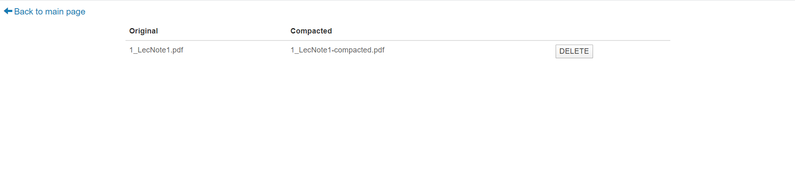

# PDF Compactor Project
a web application that allows users to upload a pdf file and return a compacted version of the file based on the user's specified DPI. 

## Features
- Compress the uploaded pdf file accroding to the radio box or the dpi entered by client
- Show the original size and the compressed size on the page
- History page helps clients check and download the pdf files(both original and compressed) uploaded by themselves 
- Initial page tells clients the number of times the page has finished processing so far
- When the uploaded file is not a pdf file, or the pdf file size is bigger than 30 mb, the client will see the corresponding error

## Implementation Overview
### frontend
- upload pdf file from client's computer
- user determine the dpi used for compression 
### backend
- store the uploaded file in sever
- execute the compression command based on the client's requirement
- delete history files (both original and compressed)
### Process Of the whole full_stack


## Tools
### Frontend
 Bootstrap + HTML + JQuery + CSS
### Backend  
 Node.js + express + multer + Ghostscript
### The pdf compression rools URL
https://github.com/ourarash/shrinkpdf

## Before Starting
For Mac, ignore this part.

For Windows, turn to app.js and change the code line from 104-111

    var command = `${dir}/shrinkpdf.bat ./originalFiles/${originalFile} ./compactedFiles/${compactedFile}`;
    if (quality == 300 || quality == 144 || quality == 60) {
        command = `${dir}/shrinkpdf.bat ./originalFiles/${originalFile} ./compactedFiles/${compactedFile} ${quality}`;
    }
    else {
        command = `${dir}/shrinkpdf.bat ./originalFiles/${originalFile} ./compactedFiles/${compactedFile} ${resolution}`;

    }

## Start The Project
- Firstly, install NodeJs (https://nodejs.org/en/download/) and Ghostscript (check this link carefully https://github.com/ourarash/shrinkpdf). 
- Clone this repo and install all required modules:

```bash
git clone https://github.com/guiquansun/PDF-Compactor.git 
cd PDF_Compactor
npm install
```

- Run:
```bash
node app.js
```

- Test:
```bash
npm test
```


- Now open your browser to http://localhost:3000

- Upload a pdf file and the page is switched.

- Click Process button to do the compression

- See your history files


## Future Work
- Upload multiple files simultaneously by users, and compress these files by backend server.
- Upload files from Google Drive or Dropbox
- Use other PDF compression tools that are more efficient and have higher speed.

## Group members
Linxin Mai linxinma@usc.edu

Guiquan Sun  gsun@usc.edu

## YouTube link：
https://www.youtube.com/watch?v=6Zd7mUN6C9A&feature=youtu.be
